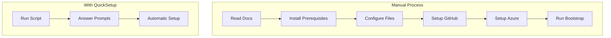
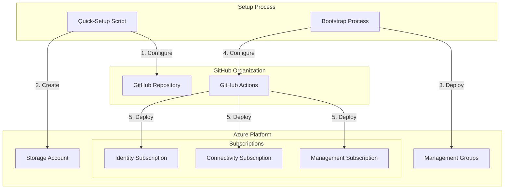
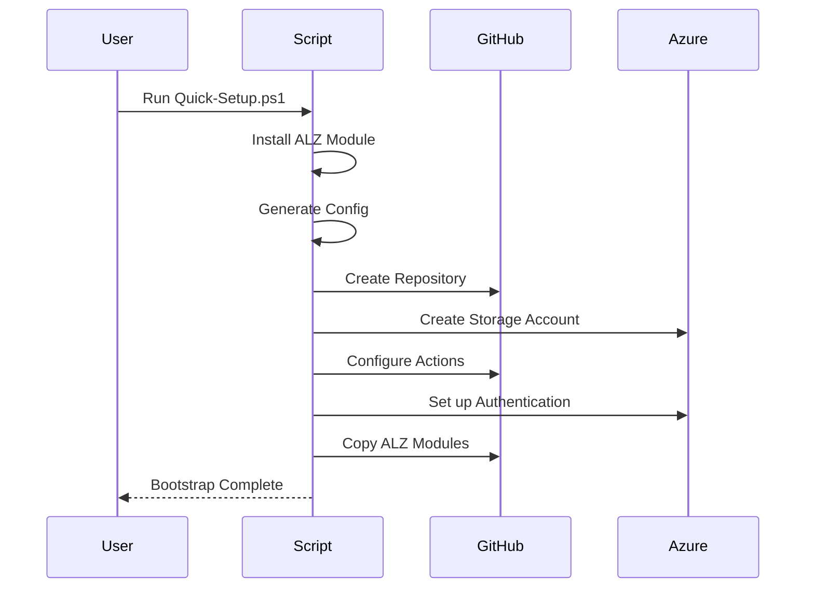
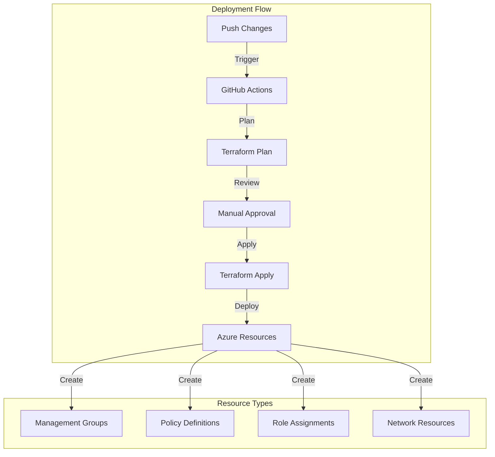
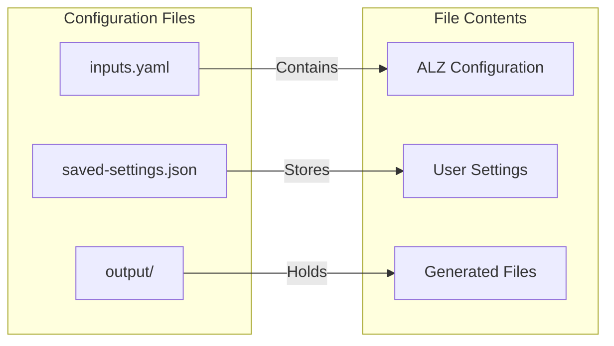

# ALZ QuickSetup - Azure Landing Zone Accelerator Bootstrap Helper

This repository contains a PowerShell script that streamlines and simplifies the process of bootstrapping the Azure Landing Zone (ALZ) Terraform Accelerator with GitHub integration. It is **not** an official module, but rather a helper script that follows and automates the steps outlined in the [official Azure Landing Zones documentation](https://azure.github.io/Azure-Landing-Zones/accelerator/userguide/#get-started).

## Purpose

The main goal of this script is to make it easier and faster to get started with Azure Landing Zones by:

1. **Simplifying the Setup Process**: Converting the multi-step manual process into an interactive, guided experience
2. **Reducing Human Error**: Automating the creation and configuration of required files and resources
3. **Saving Time**: Remembering your choices for future runs and providing sensible defaults
4. **Ensuring Consistency**: Following the official documentation steps in a repeatable way

This script is ideal for:
- Teams getting started with Azure Landing Zones
- DevOps engineers setting up multiple landing zones
- Anyone who wants to quickly bootstrap an ALZ environment with GitHub integration

## How It Works

The script automates the steps from the [official ALZ Accelerator guide](https://azure.github.io/Azure-Landing-Zones/accelerator/userguide/#get-started) by:

1. Checking and installing prerequisites automatically
2. Guiding you through the required inputs with clear prompts
3. Saving your preferences for future runs
4. Creating and configuring all necessary files and resources
5. Setting up the GitHub repository and Azure resources
6. Bootstrapping the ALZ environment



## Architecture Overview



## What the Bootstrap Process Does

The ALZ Terraform Accelerator bootstrap process:

- Creates a GitHub repository with the required structure
- Sets up GitHub Actions workflows for CI/CD
- Creates Azure resources for Terraform state management (storage account, containers, etc.)
- Configures authentication between GitHub and Azure
- Copies the ALZ Terraform modules to the repository



**Important:** The bootstrap process does NOT execute the actual Terraform code that builds your landing zone. It only sets up the infrastructure and pipeline that will be used for deployment. The actual deployment of your landing zone happens when:

1. The bootstrap process completes successfully
2. You push changes to the repository 
3. GitHub Actions runs the Terraform pipeline to deploy your landing zone resources

## Prerequisites

Before running the Quick-Setup script, ensure you have:

### Required Software
1. **PowerShell Core (7.x or higher)**
   - Download from: https://github.com/PowerShell/PowerShell/releases
   - Required for running the setup script
   - Windows PowerShell 5.1 is NOT supported

2. **Azure CLI** (Recommended)
   - Download from: https://docs.microsoft.com/en-us/cli/azure/install-azure-cli
   - Used for Azure authentication and resource management
   - While optional, it's recommended for better Azure integration

### PowerShell Modules
The script will automatically install these if missing:
1. **Az Module** (v9.3.0 or higher)
   - Azure PowerShell module
   - Will be installed automatically if missing
   - Manual install: `Install-Module -Name Az -Scope CurrentUser -Force`

2. **ALZ Module**
   - Azure Landing Zone PowerShell module
   - Will be installed automatically if missing
   - Manual install: `Install-Module -Name ALZ -Scope CurrentUser -Force`

### Required Access and Permissions
1. **GitHub Organization Account**
   - Personal accounts won't work
   - Must have admin access to the organization
   - Ability to create repositories and set up GitHub Actions

2. **GitHub Personal Access Token (PAT)**
   - Required scopes:
     - repo (Full control)
     - workflow
     - admin:org
     - read:user
     - user:email
     - delete_repo
   - If using SSO, must be authorized for your organization

3. **Azure Subscriptions**
   - Management Subscription
   - Connectivity Subscription
   - Identity Subscription
   - All three can be the same subscription for testing
   - Must have Owner permissions on all subscriptions

4. **Azure Permissions**
   - Owner role on all subscriptions
   - Ability to create resource groups
   - Ability to create storage accounts
   - Ability to assign roles

## Quick Setup Process

### 1. Create GitHub Personal Access Token (PAT)

1. Navigate to GitHub.com > Settings > Developer Settings > Personal access tokens > Tokens (classic)
2. Generate a new token with note "Azure Landing Zone Terraform Accelerator"
3. Set expiration (recommend 30-90 days)
4. Enable these scopes:
   - repo
   - workflow
   - admin:org
   - user: read:user
   - user: user:email
   - delete_repo
5. If using SSO, authorize the token for your organization

### 2. Run the Quick Setup Script

1. Execute the PowerShell script:

```powershell
.\Quick-Setup.ps1
```

2. Follow the prompts to provide:
   - GitHub organization name
   - Repository name (default: alz-terraform-accelerator)
   - Azure Tenant ID
   - Azure Subscription IDs (Management, Connectivity, Identity)
   - Preferred Azure region
   - GitHub PAT token

3. The script will:
   - Install the ALZ PowerShell module if not present
   - Create necessary directories
   - Generate a unique storage account name
   - Create the configuration file
   - Save your settings for future runs
   - Offer to run the bootstrap process

### 3. Run the Bootstrap

When prompted to run the bootstrap:
1. Type 'Y' to proceed
2. The bootstrap process will:
   - Create Azure resources for Terraform state management
   - Create a GitHub repository
   - Configure GitHub Actions workflows
   - Set up the ALZ environment
   - Apply the Terraform bootstrap configuration

## Manual Bootstrap

If you prefer to run the bootstrap manually after setup:

```powershell
Deploy-Accelerator -inputs ".\config\inputs.yaml" -output ".\output"
```

## Next Steps After Bootstrap

After successful bootstrap:

1. Access your new GitHub repository
2. The bootstrap does not automatically deploy your landing zone - it only creates the infrastructure needed for deployment
3. To start the actual landing zone deployment:
   - Make any necessary customizations to the Terraform configuration
   - Commit and push changes to the repository
   - The GitHub Actions workflow will automatically run the Terraform pipeline
   - Approve the workflow to deploy your landing zone



## Configuration Files

The setup process creates and manages these files:

- `config/inputs.yaml`: Main configuration file for the ALZ Terraform Accelerator
- `config/saved-settings.json`: Stores your input values for future runs
- `output/`: Directory containing the bootstrap output and generated files



## Additional Resources

- [Azure Landing Zones Documentation](https://azure.github.io/Azure-Landing-Zones/)
- [ALZ Terraform Accelerator User Guide](https://azure.github.io/Azure-Landing-Zones/accelerator/userguide/2_start/terraform-github/)
- [Terraform AVM for Platform Landing Zone](https://azure.github.io/Azure-Landing-Zones/accelerator/starter-modules/terraform-avm-ptn-alz/) 